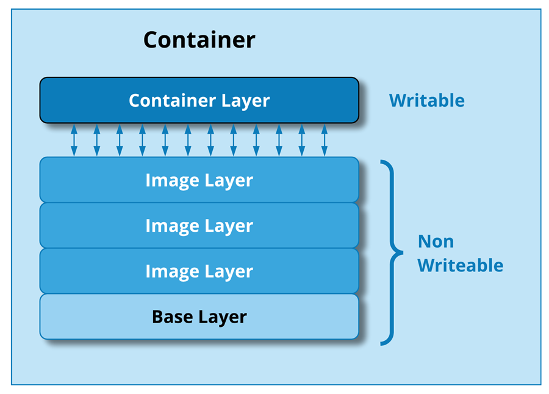

### Software Engineering 2
## 4 Processes and Tools (Prozesse und Werkzeuge)

# Docker

1. [Docker](                #1-docker)
2. [Getting Started](       #2-getting-started)
3. [Docker Images](         #3-docker-images)
4. [Docker Containers](     #4-docker-containers)
5. [Basic Docker Commands]( #5-basic-docker-commands)
6. [References](            #6-references)


<!-- - - - - - - - - - - - - - - - - - - - - - - - - - - - - -->
&nbsp;

## 1. Docker

`Docker` is a widely used software packaging, distribution and execution infrastructure
using containers:

- First introduction of Docker by: *Salomon Hykes* at PyCon 2013, Santa Clara CA:
  *"The Future of Linux Containers"*
  ([video](https://www.youtube.com/watch?v=9xciauwbsuo), 5:21min).

- Docker runs on Linux and Unix-Operating Systems only using specific technologies.
  On Windows, Docker runs on Linux in an internal Hyper-V virtual machine.

- Docker has a
  [Client/Server-Architecture](https://docs.docker.com/get-started/overview/#docker-architecture)
  with:
  - server-side *Docker Engine*, which is a Linux process: *dockerd*.
    Permanent Unix processes/services are often called *daemons*.
    Process *dockerd* listens on (default) TCP port 2375 that can be reached
    from clients over the network.

  - client-side tools such as commands from the Docker Command-Line-Interface
    ( [CLI](https://docs.docker.com/engine/reference/commandline/cli/) ) or
    GUI such as
    [Docker Desktop](https://docs.docker.com/desktop/install/windows-install/))
    that can also be used to create, manage and execute containers.

  - a *Registry* such as
    [Docker Hub](https://hub.docker.com)
    allows to share images, into which developers have packaged
    their software. Containers can be created from images pulled from a registry
    in any other Docker environment.

  
<!--  -->
<!--
  .

  .
-->


Docker builds on Unix/Linux technologies:

- **Stackable filesystem images** that provide a compounded view (union) at
  each layer of files and directories of underlying images
  ([union filesystem](https://medium.com/@knoldus/unionfs-a-file-system-of-a-container-2136cd11a779)).

- **Containers with a group of processes** that run in full isolation of processes
  running in other containers/process groups (Linux
  [LXC](https://linuxcontainers.org/) or similar technologies).

Dockerized applications run as processes in containers

- on the *same* **host operating system** (e.g. a laptop, a server machine),

- which is the difference to running applications in virtual machines (VM), which
  each have their own **guest operating systems** running inside the VM,
[link](https://cloudacademy.com/blog/docker-vs-virtual-machines-differences-you-should-know/),
[img](https://cloudacademy.com/wp-content/uploads/2019/10/Docker-vs..png).


Docker created tools around existing technologies (stackable images, running processes
in isolated containers) in order to:

- build, manage, distribute and share images ("container ship" metaphor in the Docker
[logo](https://www.docker.com/wp-content/uploads/2022/03/Moby-logo.png)):

- deploy and use software (e.g. MySQL database) without further installation in
  the host system ("turn-on" software metaphor).

- Package and ship own software "as-a-container" (actually as *image*) to deploy
  in any Docker target environment.

Packaging and distributing software as a container becomes part of the
**software build** process.


<!-- - - - - - - - - - - - - - - - - - - - - - - - - - - - - -->
&nbsp;

## 2. Getting Started

Docker-Desktop is a good Docker distribution to
[install](https://docs.docker.com/get-docker/).
It comes with a GUI and complete installation for *Windows*, *Mac* and *Linux*.

- Docker's [Getting Started](https://docs.docker.com/get-started/) guide explains
basic concepts and steps:

  - [Docker image](#3-docker-images) contains files and directories that have been created
    during an `image build` step, in which files and directories have been added to an
    underlying `base image`, on which the image is based. The built-upon image only contains
    the `difference` to the base image. The compound view has all files and directories of
    both, the base and the built-upon image.

  - [Image layer Stack](#3-docker-images) is a stack of images that have been built one above
    the over, each image potentially coming from a different source.
    Processes in a container see the compound view of files and directories from all images
    of the stack.

  - `Process` is an environment, in which a program executes. When a program is started,
    a process is created that executes the program. When execution ends, the process is
    also terminated. Resources needed to run the program are assigned to the process
    such as memory, CPU run-time, ports, files etc.
    Multiple processes can run the same program.

  - [Docker container](#4-docker-containers) is an environment, in which a `group of process`
    executes, that are `fully isolated` from processes in another container on a machine.

  - [Docker Registry](https://hub.docker.com) is a network service from which Docker images
    can be obtained or shared.


- Try running commands from [docker_demo.sh](docker_demo.sh).

- Refer to [KNOWN_ISSUES](KNOWN_ISSUES.md) if you experience errors such as:

  - *"image platform does not match host platform"* for Mac with Apple M1 chip or

  - *"failed to create shim task: OCI runtime create failed"* or
    *"the input device is not a TTY"* with GitBash.


<!-- - - - - - - - - - - - - - - - - - - - - - - - - - - - - -->
&nbsp;

## 3. Docker Images

Docker uses stacked images (or image layers) of the
[union filesystem](https://medium.com/@knoldus/unionfs-a-file-system-of-a-container-2136cd11a779)
to create a view processes see with directories and files comprised from the
*union* of files and directories from all underlying images.

Images are **read only** and can therefore be shared between multiple containers,
except for the top image, which is specific for each container.

- A **base image** forms the bottom of an image stack, onto which other images are
  built.
  - [Ubuntu](https://hub.docker.com/_/ubuntu)
    is an example of a simple base image (77 MB), which includes many command line
    tools Ubuntu offers.
    It can be used to install own software in an overlaying image.

  - [Alpine](https://hub.docker.com/_/alpine) is a minimalist base image (only 3 MB),
    which only includes few commands. It is preferred to build "small" containers.

  - To run Java applications, one of the distributions from
    [openjdk](https://hub.docker.com/_/openjdk/tags)
    images can be used as base images, e.g.:

    - [adoptopenjdk/openjdk11:alpine](https://hub.docker.com/_/adoptopenjdk) is a base
      image that includes OpenJDK, version 11 based on
      [alpine:3.14](https://hub.docker.com/_/alpine) image, see
      [Dockerfile](https://github.com/AdoptOpenJDK/openjdk-docker/blob/master/11/jdk/alpine/Dockerfile.hotspot.nightly.full).

    - [openjdk:21-slim](https://hub.docker.com/layers/library/openjdk/21-slim/images/sha256-cd476ec4c21eb3d20fb9d2e6bcd556825f3c5be5f1459bb0d891af1870154797?context=explore)
      is another distribution of OpenJDK, version 21.

- Each **interim image** of the image stack builds above an underlying image and
  includes changes (only the differences) to the underlying image.

  - To build an image, commands must be performed that change the file system state
    in the container's top image, e.g. by installing new software.

  - Base image and commands performed in this base image are described in `Dockerfile`,
    based on which `docker build` creates the new image.

  - New containers can then be created and started from the new image.

- The **top image** layer is created with a container and is specific to this
  container. It is the only image into which processes of the container can write
  or alter files.

  


Commands:

```
docker images
```

Output shows (cached) docker images:

```
REPOSITORY                 TAG                 IMAGE ID       CREATED        SIZE
alpine                     latest              5e2b554c1c45   2 weeks ago    7.33MB
hello-world                latest              9c7a54a9a43c   3 weeks ago    13.3kB
ubuntu                     latest              3b418d7b466a   4 weeks ago    77.8MB
andreper/jupyterlab        3.0.0-spark-3.0.0   63464f7d6397   5 months ago   2.31GB
mysql/db-freerider_img     8.0                 cc3f0c019fe8   5 months ago   538MB
openjdk11/app.jar_img      latest              8f8861760b15   6 months ago   343MB
mysql                      8.0                 3842e9cdffd2   6 months ago   538MB
```

Creating and running an `alpine` container showing files (`ls -la`) that are only
visible inside the container (in the top-layer of its image stack).

```
# create and run container, open shell process running inside the container
docker run --name alpine_container01 -it alpine:latest /bin/sh

# once container is created, only start it
docker start ubuntu_container01 -ai

# inside the container shell: enter command to show files inside the container
/ # ls -la

exit    # exist sh-process and return to host system
```

Root (`/`) directory of the file system that is visible *inside* the container:

```
total 64
drwxr-xr-x    1 root     root          4096 May 28 14:19 .
drwxr-xr-x    1 root     root          4096 May 28 14:19 ..
-rwxr-xr-x    1 root     root             0 May 28 14:19 .dockerenv
drwxr-xr-x    2 root     root          4096 May  9 18:39 bin
drwxr-xr-x    5 root     root           360 May 28 14:21 dev
drwxr-xr-x    1 root     root          4096 May 28 14:19 etc
drwxr-xr-x    2 root     root          4096 May  9 18:39 home
drwxr-xr-x    7 root     root          4096 May  9 18:39 lib
drwxr-xr-x    5 root     root          4096 May  9 18:39 media
drwxr-xr-x    2 root     root          4096 May  9 18:39 mnt
drwxr-xr-x    2 root     root          4096 May  9 18:39 opt
dr-xr-xr-x  206 root     root             0 May 28 14:21 proc
drwx------    1 root     root          4096 May 28 14:21 root
drwxr-xr-x    2 root     root          4096 May  9 18:39 run
drwxr-xr-x    2 root     root          4096 May  9 18:39 sbin
drwxr-xr-x    2 root     root          4096 May  9 18:39 srv
dr-xr-xr-x   13 root     root             0 May 28 14:21 sys
drwxrwxrwt    2 root     root          4096 May  9 18:39 tmp
drwxr-xr-x    7 root     root          4096 May  9 18:39 usr
drwxr-xr-x   12 root     root          4096 May  9 18:39 var
```


<!-- - - - - - - - - - - - - - - - - - - - - - - - - - - - - -->
&nbsp;

## 4. Docker Containers

A Docker container has:

- an `id` (e.g. 5a93421c4d3b), a `name` (e.h. "hello-world"),

- a writable `top-layer image`, into which processes of the container can perform
  changes to the file system.

- a group of processes that can be started inside the container that are fully
  isolated from processes in other containers.

  - Processes see content in the file system that is comprised from the image stack
    from which the container was created.

  - [Mounts](https://docs.docker.com/storage/bind-mounts/) or
    [Volumes](https://docs.docker.com/storage/volumes/)
    must be configured for a container to make files from the host-environment
    visible inside a container.

  - Ports (e.g. port 3306 of *mysqld*, the server process of the MYSQL database),
    process-id and other resources used inside the container are only visible inside
    the container.

- a `status`, a container is `active` when at least one process is active in the
  container. A container is `dormant` (inactive) when no process exists.

The figure shows 4 containers created on the same image stack. Each container has its
own **top image layer**, shown as "thin" read/write (R/W) layer.


Show docker containers that have been created (`-a` show all containers, including
dormant containers with currently no running processes):

```
docker ps -a
```

Output shows all currently existing active and dormant containers:

```
CONTAINER ID  IMAGE                       STATUS                     NAMES
ad0212f71173  alpine:latest               Exited (0) A minute ago    alpine_container01
6423e8382004  alpine:latest               Exited (0) 15 minutes ago  tender_wescoff
348da7c24ab4  alpine                      Exited (0) 15 minutes ago  keen_faraday
6ff7140e4f6c  alpine                      Created                    condescending_solomon
5a93421c4d3b  ubuntu                      Exited (0) 2 days ago      festive_darwin
93e0a24d8ff2  mysql/db-freerider_img:8.0  Exited (0) 4 months ago    db-freerider_MySQLServer
3c89364d3709  openjdk11/app.jar_img       Exited (0) 5 months ago    java_app_container
```


<!-- - - - - - - - - - - - - - - - - - - - - - - - - - - - - -->
&nbsp;

## 5. Basic Docker Commands

Basic docker [commands](https://docs.docker.com/engine/reference/commandline/docker/):

- *Image lifecycle* commands (lifecycle: states over creation, existence, removal):

  - `docker build | rmi ` (rmi: remove image),

  - `docker pull | push ` from/to a registry.

- *Container lifecycle* commands:

  - `docker run | start | stop | rm ` (rm: remove container).

  - `docker exec ` - attach processes to container.

- *Inspection* commands:
  - show images: `docker images`,

  - show containers: `docker ps -a ` (existing and running containers `-a`),

  - show output: `docker logs`.


<!-- - - - - - - - - - - - - - - - - - - - - - - - - - - - - -->
&nbsp;

## 6. References

For further reference, find information at links:

* Getting Docker (installation), [here](https://docs.docker.com/get-docker).

* Docker Reference, [here](https://docs.docker.com/reference).

  * Docker Commands,  [here](https://docs.docker.com/engine/reference/commandline/docker),
  [cheatsheet](https://devhints.io/docker)

  * Dockerfile [cheatsheet](https://devhints.io/dockerfile).

* Docker Hub, [link](https://hub.docker.com).

* Orchestration (docker-compose)

  * Compose Reference, [here](https://docs.docker.com/compose/features-uses),

  * docker-compose [cheatsheet](https://devhints.io/docker-compose).

* Docker Meetups Berlin, [past events](https://www.meetup.com/docker-berlin/events/past), [upcoming](https://www.meetup.com/docker-berlin/events/upcoming).

* [DockerCon](https://docker.events.cube365.net),
  [DockerCon'22](https://docker.events.cube365.net/dockercon/2022),
  San Francisco May 9-10, 2022,
  [YouTube](https://www.youtube.com/c/DockerIo/playlists).

* *Salomon Hykes*: *"The Future of Linux Containers"* ([video](https://www.youtube.com/watch?v=9xciauwbsuo), 5:21min), PyCon 2013, Santa Clara CA, Mar 13-21, 2013.


