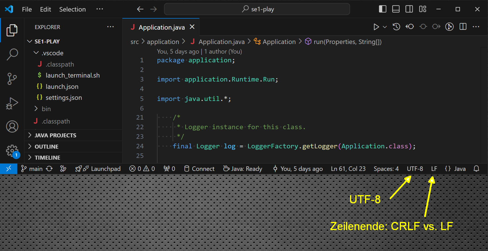
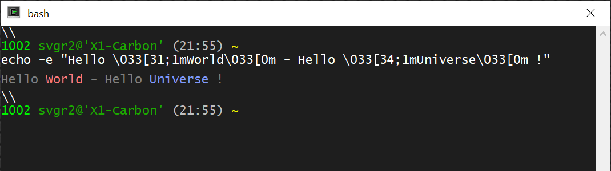
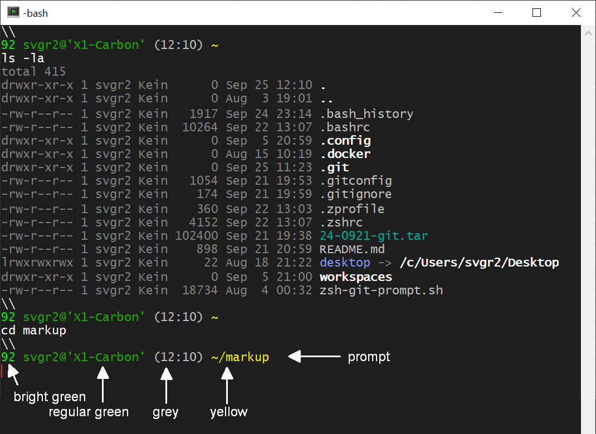

## 1. *Terminal* and *Shell*

Topics:
- a) [What is a Terminal?](#a-what-is-a-terminal)
- b) [What is a Software-Terminal?](#b-what-is-a-software-terminal)
- c) [Why are terminals relevant today?](#c-why-are-terminals-relevant-today)
- d) [ASCII, UTF-8 and ANSI Escape Codes](#d-ascii-utf-8-and-ansi-escape-codes)
- e) [What is a *Shell*?](#e-what-is-a-shell)
- f) [Which *Shell* do I use (Mac: *zsh*, other: *bash*)?](#f-which-shell-do-i-use)
- g) [Hall of Fame](#g-hall-of-fame)


---
&nbsp;
### a) What is a Terminal?

A (Software-) Terminal is an application that emulates the behavior of a
hardware terminal comprised of a alphanumiercal screen for text output and
a keyboard for input.

The figure shows a
[*VT100*](https://en.wikipedia.org/wiki/VT100) terminal by *Digital Equipment
Corporation* (DEC, 1978).


The unit is *not a PC*. The unit only contains:

- a *screen* to show alphanumerical output (lines) and

- a *keyboard* to type input (lines).

The terminal must be connected to a separate computer (e.g. a
[*DEC VAX*](https://fedtechmagazine.com/article/2017/07/decs-vax-superminicomputer-became-mainstay-federal-research)).

Interacting with a computer by text-line input and output is the most
basic form of human-machine interaction.


---
&nbsp;
### b) What is a Software-Terminal?

A *Software-Terminal* emulates line-based text input and output
in a window. Terminals can connect to local or remote *machines*,
*virtual machines* and *containers*.

There is a long list of terminal software also known as
[*terminal emulators*](https://en.wikipedia.org/wiki/List_of_terminal_emulators).

- [*mintty*](https://en.wikipedia.org/wiki/Mintty) - terminal emulator used
    by *cygwin*.

- [*putty*](https://www.putty.org) - terminal emulator that allows remote
    login over various protocols, but does not provide a local terminal.

- [*tmux*](https://www.perl.com/article/an-introduction-to-tmux/) is a
    *terminal multiplexer* that can split a larger window into multiple
    terminal panes, each running their own terminal session [3].

*Linux*, *MacOS* have decent terminal software pre-installed (just *"open a
Terminal"*).

Windows does not package decent terminal software. *Cmd.com*, *Powershell.exe*
are incompatible and do not work over the network. Hence, terminal software
must be installed separately for Windows.

Good choices for terminal software for Windows are:

- [*cygwin*](https://www.cygwin.com) - a comprehensive package of Unix-tools
    that emulates a *Unix* environment on Windows (emulator: it appears like
    *Unix*, but runs on *Windows*), including *mintty* terminal emulator.

    To install and setup *cygwin* on *Windows*, follow
    [*instructions*](https://github.com/sgra64/markup/blob/main/setup_cygwin/README.md),
    make sure to switch `/cygdrive/c` to `/c` and select a `$HOME` directory.

- *GitBash* is a restricted *Unix* emulator primarily for *git*. It also includes
    a terminal emulator (`git-bash.exe`). *GitBash* has short-comings over *cygwin*,
    hence *cygwin* should be preferred.


---
&nbsp;
### c) Why are terminals relevant today?

Developers do not only work on their laptops. They ususally connect to other
computers or compute containers over the network through terminal windows,
e.g. through
[*ssh*](https://www.techtarget.com/searchsecurity/definition/Secure-Shell) -
*secure shell* connections.


The terminal is the *universal interface* to those systems such as
[*Virtual Machines (VM)*](https://www.vmware.com/topics/virtual-machine)
or [*Docker Containers*](https://www.docker.com/resources/what-container/)
running on the local system or are running on remote systems such as in a
*Compute Cloud*
([*Amazon EC2*](https://aws.amazon.com/ec2/),
[*Microsoft Azure*](https://azure.microsoft.com/en-us) or
[*Google Cloud*](https://cloud.google.com/) ).

Today, developers work with many terminal windows on their laptops
to interact with local and/or remote machines.

Connectivity to remote computers makes software terminals essential in
modern software development. Hence, developers must understand terminals.


---
&nbsp;
### d) ASCII, UTF-8 and ANSI Escape Codes

Initially, hardware terminals had limited capabilities to display Latin letters,
numbers and symbols such as `.`, `+` or `$`.

[*ASCII*](https://www.ascii-code.com) (American Standard Code for Information
Interchange, 1963) standardized codes using 8 bits. 

Codes `[0 - 31]` are reserved for controlling the terminal, e.g.:
- Code 08 (`0x08`) - `BS` (Backspace)
- Code 13 (`0x0A`) - `CR` (Carriage Return `\r`)
- Code 10 (`0x0A`) - `LF` (Line Feed or newline `\n`)

*Unix* systems (*Linux, Mac, Android,* ...) issue `LF` as line ending.
*Windows* uses two characters: `CR` `LF` as line ending causing errors and
confusion when files are exchanged between these two systems (e.g. via a
*git* - repository).

Codes `[31 - 127]` are used for Latin letters, numbers and symbols, e.g.:
- Code 65 (`0x41`) - `A`
- Code 97 (`0x61`) - `a`
- Code 48 (`0x30`) - `0`
- Code 36 (`0x24`) - `$`

Later, characters in the upper 8-bit range: `[128 - 255]` were included,
e.g. for German Umlauts, French accent markers or currency symbols:
- Code 142 (`0x8E`) - `Ä`
- Code 138 (`0x8A`) - `é`
- Code 156 (`0x9C`) - `£`

The full ASCII-table is:


However, only 255 characters can be used with 8 bits and symbols from other
languages (e.g. Chinese) or newer symbols such as the Euro (`€`) cannot be
included.

To overcome the problem, various technologies emerged such as
[ISO/IEC 8859](https://en.wikipedia.org/wiki/ISO/IEC_8859) (1985) to
define several 8-bit coding sets, e.g.
[ISO/IEC_8859-1](https://en.wikipedia.org/wiki/ISO/IEC_8859-1),
[-2](https://en.wikipedia.org/wiki/ISO/IEC_8859-2),
[-3](https://en.wikipedia.org/wiki/ISO/IEC_8859-3), etc.

Supporting terminals could switch between coding sets, but only display
256 symbols of the selected set at a time.

Microsoft introduced its own variety called
`DOS` or [Windows Code Pages](https://en.wikipedia.org/wiki/Windows_code_page)
in 1988, which is still present in Windows today.

[*UTF-8*](https://en.wikipedia.org/wiki/UTF-8) (*Ken Thompson*, *Rob Pike*, 1992)
is a flexible coding scheme for
[*Unicode*](https://en.wikipedia.org/wiki/Unicode)
that uses 8-bit (UTF-8) for base characters (compatible to ASCII [0 - 127])
and variable `2`, `3` or `4` byte coding for other symbols.

- *2-Byte coding* is used when the lead byte starts with `110`, followed
by a byte starting with `10` leaving (16-3-2) 11 bits or 2048 characters
for 2-byte UTF-8 values.

- *3-Byte coding* is used when the lead byte starts with `1110`, followed
by a byte starting with `10` leaving (24-4-2-2) 16 bits or 65.536 characters
for 3-byte UTF-8 values.

- *4-Byte coding* is used when the lead byte starts with `11110`, followed
by a byte starting with `10` leaving (32-5-2-2-2) 21 bits or 2.097.152 characters
for 4-byte UTF-8 values.

In theory, the scheme can continue to higher byte-values. More detail about
about encodings and character sets can be found in a good article [4].

The [Euro (€)](https://symbl.cc/en/20AC/) symbol is represented in:
- *UTF-8* Encoding: `0xE282AC` - characters use 8 bit.
    - the lead-byte starting with `1110` (`0xE`) means two bytes follow:
        ```sh
             1110 0010 1000 0010 1010 1100      # 0xE2 0x82 0xAC
             ---- 0010 1000 0010 1010 1100      # remove lead code '1110'
             ---- 0010 --00 0010 --10 1100      # remove '10' from folloging bytes
                          0010000010101100      # collect remaining bits
                       0010 0000 1010 1100      # re-byte the remaining bits
                       0x02 0x00 0x0A 0x0C      # bits as hexadecimal numbers
                                  = 0x20AC      # Unicode-value for the '€'-symbol
        11 100 010  10 000 010  10 101 100      # 0xE2 0x82 0xAC as octets
         3   4   2   2   0   2   2   5   4      # octal values: 0342, 0202, 0254
        ```
        - removing leading `10` from bytes leaves:

- *UTF-16* Encoding: `0x20AC` - all characters use 16 bits (no bit manipulation).

- *UTF-32* Encoding: `0x000020AC` - all characters use 32 bits (no bit manipulation).

Most (Software) Terminals support *UTF-8* it, but may need to be put into
that mode, e.g. on Windows by selecting code page 65001 with the *change code page*
command: `chcp.com 65001`

Test `UTF-8` capabilities mode in your terminal:

```sh
echo I\'d pay 10€ to see 10€ here
```

Output:

```
I'd pay 10€ to see 10€ here
```

```sh
echo -e "I won't pay 10\0342\0202\0254 for this"    # print '€' as UTF-8 octets
```

Output:

```
I won't pay 10€ for this
```

IDE such as *VSCode* show the mode they use: `CRLF` or `NL` for line-endings
and: `UTF-8` for character encoding. Make always sure to select `NL` and `UTF-8`
(click the indicators):




&nbsp;

Another topic of terminal configuration is color.
[*ANSI*](https://en.wikipedia.org/wiki/ANSI_escape_code)
is a standard supported by many terminals for displaying color and extended
control functions such as positioning the cursor.

With *ANSI*, so-called *"escape sequences"* starting with the `ESC` character
(octal: `\033`, hexadecimal: `0x1B` or decimal: `27`) followed by a code, e.g.
to select a color: `[31;1` (red) the terminal is switched to that color for the
following characters.

For example, in order to display text in red, escape sequence: `"\033[31;1m"`
is issued before the text (`"World"`), and after the text, the terminal is
reset with escape sequence: `"\033[0m"`:

```sh
echo -e "Hello \033[31;1mWorld\033[0m - Hello \033[34;1mUniverse\033[0m !"
```



&nbsp;

This mechanism is used to color terminal output and also to color the
terminal prompt (`PS1`).



Special environment variable with name `PS1` represents the prompt-string,
which is displayed before each command. Show your prompt string:

```sh
echo $PS1
```

Prompts can be largely
[*customized*](https://wiki.archlinux.org/title/Bash/Prompt_customization)
by setting `PS1`, e.g. with the help
of a [*prompt-generator*](https://bash-prompt-generator.org/) or with
prompt libraries such as
[*Oh My ZSH!*](https://ohmyz.sh/) (for Mac).


---
&nbsp;
### e) What is a *Shell*?

A ["*Shell*"](https://www.datacamp.com/blog/what-is-shell) is a process
the reads input from `stdin` (e.g. a keyboard connected to the terminal),
interprets this input as a *shell command*, executes the command or forks a
process that executes the command and outputs results to `stdout` or `stderr`
channels that, if connected to a terminal, are displayed at the terminal.

Examples of shell commands are:

```sh
cd $HOME            # change directory (cd) to the $HOME directory

pwd                 # print the current working directory (pwd)

ls -la              # list (ls) the content of current directory (-a: all files,
                    # including dotfiles, -l: long format)
```

Output:

```
pwd
/c/Sven1/svgr2

ls -la
total 415
drwxr-xr-x 1 svgr2 Kein      0 Sep 24 19:20 .
drwxr-xr-x 1 svgr2 Kein      0 Aug  3 19:01 ..
-rw-r--r-- 1 svgr2 Kein   3935 Sep 21 19:54 .ansi-colors.sh
-rw-r--r-- 1 svgr2 Kein    343 Sep 22 22:04 .bash_history
-rw-r--r-- 1 svgr2 Kein  10264 Sep 22 13:07 .bashrc
drwxr-xr-x 1 svgr2 Kein      0 Sep  5 20:59 .config
drwxr-xr-x 1 svgr2 Kein      0 Aug 15 10:19 .docker
drwxr-xr-x 1 svgr2 Kein      0 Sep 24 17:43 .git
-rw-r--r-- 1 svgr2 Kein   1054 Sep 21 19:53 .gitconfig
-rw-r--r-- 1 svgr2 Kein    174 Sep 21 19:59 .gitignore
-rw-r--r-- 1 svgr2 Kein    376 Sep 21 19:54 .minttyrc
-rw-r--r-- 1 svgr2 Kein   2184 Sep 21 19:55 .paths
-rw-r--r-- 1 svgr2 Kein   5731 Sep 21 19:55 .profile
drwxr-xr-x 1 svgr2 Kein      0 Sep 21 18:42 .ssh
-rw-r--r-- 1 svgr2 Kein   1056 Sep 21 19:55 .vimrc
-rw-r--r-- 1 svgr2 Kein    360 Sep 22 13:03 .zprofile
-rw-r--r-- 1 svgr2 Kein   4152 Sep 22 13:07 .zshrc
-rw-r--r-- 1 svgr2 Kein 102400 Sep 21 19:38 24-0921-git.tar
-rw-r--r-- 1 svgr2 Kein 102400 Sep 21 19:16 24-0921-git_BACKUP.tar
-rw-r--r-- 1 svgr2 Kein    898 Sep 21 20:59 README.md
lrwxrwxrwx 1 svgr2 Kein     22 Aug 18 21:22 desktop -> /c/Users/svgr2/Desktop
drwxr-xr-x 1 svgr2 Kein      0 Sep 24 17:48 markup
drwxr-xr-x 1 svgr2 Kein      0 Aug 17 14:12 se1-bestellsystem
drwxr-xr-x 1 svgr2 Kein      0 Sep 24 19:20 tmp
drwxr-xr-x 1 svgr2 Kein      0 Sep  5 21:00 workspaces
```

A *shell* process has no information to which input (`stdin`) or output
channels (`stdout`, `stderr`) it is connected to. Therefore, input can
also come from a (script) file or output can be written to files using
input `<` and output redirect `>`.

```sh
echo "ls -la" > ls_file     # write string: "ls -la" to file named "ls_file"
sh < ls_file                # shell reads command from the file and executes it
```

A [*"Pipe"*](https://www.geeksforgeeks.org/piping-in-unix-or-linux) ( `|` )
connects two processes with `stdout` of the first process to `stdin`
of the second process such that the second process receives the output
of the first process as input.

In the example below, the (parent-) *shell* process *creates the pipe*,
then *"forks"* two child-processes and connects their `stdin` and `stdout`
channels to the pipe.

```sh
# The shell process creates the pipe in the operating system, then forks two
# child-processes and wires their 'stdout' and 'stdin' channels to the pipe.
# 
# The first process executes "ls -la" directing output into the pipe from
# which the second process (grep) reads and filters lines that match regular
# expression: ' \.[a-z].*'

ls -la $HOME | grep ' \.[a-z].*'
```

The first process (`ls -la $HOME`) produces a listing of lines of all
files and directories of `$HOME`. It is not aware that output is connected
to a pipe feeding it into the second process (`grep ' \.[a-z].*'`), which
filters lines by the regular expression (filenames that match a space,
followed by a dot, followed by any lower-case letter sequence).

The resulting output shows only the *dotfiles* in the *$HOME* directory
(compare to the full listing above):

```
-rw-r--r-- 1 svgr2 Kein    343 Sep 22 22:04 .bash_history
-rw-r--r-- 1 svgr2 Kein  10264 Sep 22 13:07 .bashrc
drwxr-xr-x 1 svgr2 Kein      0 Sep  5 20:59 .config
drwxr-xr-x 1 svgr2 Kein      0 Aug 15 10:19 .docker
drwxr-xr-x 1 svgr2 Kein      0 Sep 24 17:43 .git
-rw-r--r-- 1 svgr2 Kein   1054 Sep 21 19:53 .gitconfig
-rw-r--r-- 1 svgr2 Kein    174 Sep 21 19:59 .gitignore
-rw-r--r-- 1 svgr2 Kein    376 Sep 21 19:54 .minttyrc
-rw-r--r-- 1 svgr2 Kein   5731 Sep 21 19:55 .profile
drwxr-xr-x 1 svgr2 Kein      0 Sep 21 18:42 .ssh
-rw-r--r-- 1 svgr2 Kein   1056 Sep 21 19:55 .vimrc
-rw-r--r-- 1 svgr2 Kein    360 Sep 22 13:03 .zprofile
-rw-r--r-- 1 svgr2 Kein   4152 Sep 22 13:07 .zshrc
```

A *terminal* process connects keyboard input to `stdin` for a *shell* process
and displays output received from *shell's* `stdout` and `stderr`.

A *terminal* therefore always has at least two processes: the process that
emulates the terminal and a *shell* process that connects to the terminal.
The *shell* process interprets commands it receives from its `stdin` channel,
which is connected to the `stdout`-channel of the terminal-process. The
`stdin` channel of the terminal-process is connected to the keyboard.
The same path exists for output commands produce.

Question: How many processes are involved with following commands typed into
a terminal?

Example 1:

```sh
# compile file 'HelloWorld.java' with the javac compiler to file 'HelloWorld.class'
javac HelloWorld.java
```

Answer:

- process 1: *terminal* software, e.g. `/usr/bin/mintty.exe`

- process 2: *shell* process, e.g. `/usr/bin/bash.exe`

- process 3: process that executes the Java compiler (that process was *"forked"*
    by the *shell* process), here the Java Compiler:
    `/c/Program Files/Java/jdk-21/bin/javac.exe`

Example 2:

```sh
ls -la $HOME | grep ' \.[a-z].*'
```

- process 1: *terminal* software, e.g. `/usr/bin/mintty.exe`

- process 2: *shell* process, e.g. `/usr/bin/bash.exe`

- process 3: process that executes the `ls -la` command (forked by *shell* process)

- process 4: process that executes the `grep` command (also forked by *shell* process)

The *shell* process creates the pipe for this command, connects `stdout`
of process 3 and `stdin` of process 4 to the pipe.

*Shell* processes can fork more child-processes depending on commands.


---
&nbsp;
### f) Which *Shell* do I use?

Many *shells* have emerged over the years, starting with the initial
*Bourne Shell: sh* (after its creator:
[*Stephen Bourne*](https://en.wikipedia.org/wiki/Stephen_R._Bourne),
1978).


Other shells are:
*C-Shell: csh* ([*Bill Joy*](https://en.wikipedia.org/wiki/Bill_Joy), 1970 at UCB),
*Korn-Shell: ksh* ([*Dave Korn*](https://en.wikipedia.org/wiki/David_Korn_(computer_scientist)), 1980) and
*Z-Shell: zsh* (Paul Falstad, 1990).

[*Brian Fox*](https://en.wikipedia.org/wiki/Brian_Fox_(programmer))
re-implemented Bourne Shell in 1989 calling it *Bourne-Again Shell: bash*.


Today, popular choices for *shells* are:
[*bash*](https://cs.lmu.edu/~ray/notes/bash) [1]
that is pre-installed on most *Unix* and *Linux* systems and also available
for Unix-emulators such as *cygwin*.

*Mac* have
[*zsh*](https://opensource.com/article/19/9/getting-started-zsh) [2]
pre-installed that differs to other shells in some details.


---
&nbsp;
### g) Hall-of-Fame

The Unix Operating system is the most influencial technical innovation
in the field of software systems in the second half of the 20th century.

All operating systems today incorporate the basic concepts developed in Unix:

- A *Kernel* that is protected from applications.

- Applications execute as *processes* in isolation from one another.

- Persistent data is organized as *files* stored in a *hierarchical filesystem*
    on an external storage medium (hard drives, SSD).

- Inter-Process Communication (IPC) allows processes to exchange data through
    *Pipes*. *Sockets* extend the concept to networks.

Most computers today run a Unix-based operating system, including *Linux*,
*Android*, *iOS*, *MacOS* as well as most containers (*Docker*).
Linux is the dominant operating system in the Cloud.

In the 1960s-1970s, *Ken Thompson* invented the UNIX operating system with
*Dennis Ritchie* at *AT&T Bell Labs*.
They also worked on a programming language called *B*, which *Dennis Ritchie* and
*Bryan Kernighan* evolved to the programming language *C*, which is still used
to implement the Linux Kernel.
*Ken Thompson* and *Rob Pike* worked on an operating system Plan 9, which
introduced new concepts such as the layered filessystem. At Google, they worked
on the programming language *Go* (Google, 2009).

For their contributions, *Ken Thompson* and *Dennis Ritchie* received the
[Turing Award](https://amturing.acm.org/byyear.cfm) in 1983.

 [Ken Thompson](https://en.wikipedia.org/wiki/Ken_Thompson) (*1943)

 [Dennis Ritchie](https://en.wikipedia.org/wiki/Dennis_Ritchie) (1941-2011)

 [Brian Kernighan](https://en.wikipedia.org/wiki/Brian_Kernighan) (*1942)

 [Rob Pike](https://en.wikipedia.org/wiki/Rob_Pike) (*1956)

 [Linux Torvalds](https://en.wikipedia.org/wiki/Linus_Torvalds) (*1969)


2019: [*50 Years of Unix*](https://www.bell-labs.com/about/history/innovation-stories/50-years-unix), Celebration, AT&T Bell Labs (now Nokia Labs), also known for the
[Unix Puzzle](https://www.unixgame.io/unix50).

2019: *Ken Thompson interviewed by Brian Kernighan at VCF East 2019*,
[Youtube](https://www.youtube.com/watch?v=EY6q5dv_B-o) video (1:03:50).


&nbsp;
---
### References

- [1] Ray Toal,
    [*Introduction to Bash*](https://cs.lmu.edu/~ray/notes/bash/).

- [2] Seth Kenlon,
    [*Getting started with Zsh*](https://opensource.com/article/19/9/getting-started-zsh),
    (2019).

- [3] David Farrell: [*An Introduction to Tmux*](https://www.perl.com/article/an-introduction-to-tmux/), (2016).

- [4] David C. Zentgraf: [*What every Programmer needs to know about Encodings and Character Sets*](https://kunststube.net/encoding/), (2015).


&nbsp;
---
