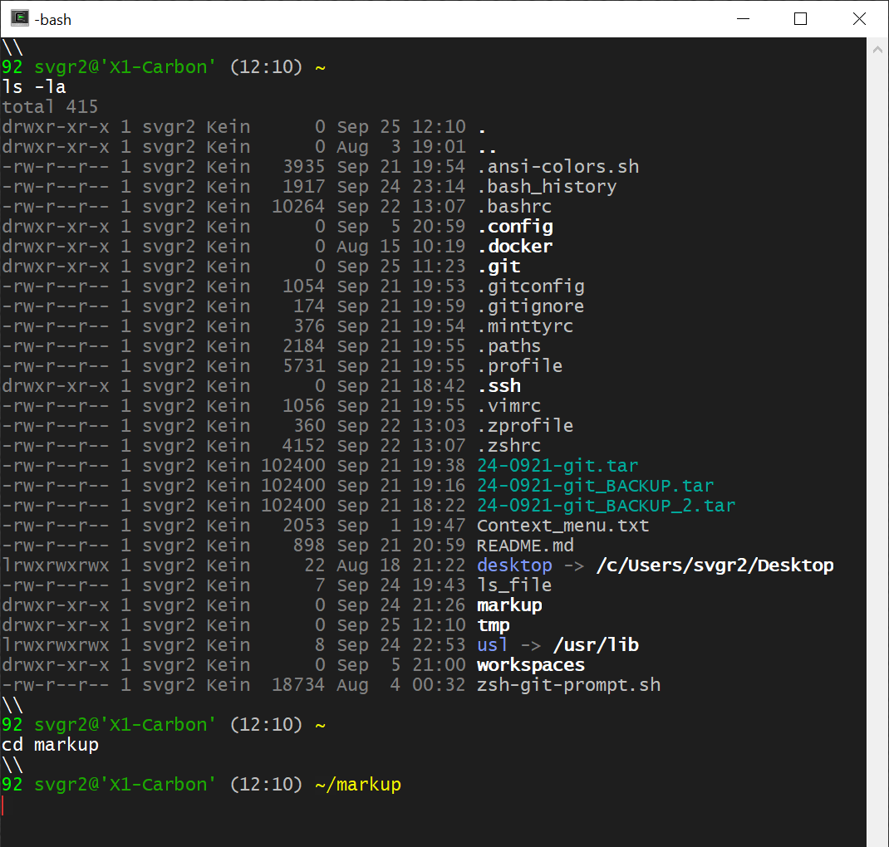

## 1. *Terminal* and *Shell*

Topics
- a) [What is a (Software-) Terminal?](#a-what-is-a-software--terminal)
- b) [Why are terminals relevant today?](#b-why-are-terminals-relevant-today)
- c) [ASCII, UTF-8 and ANSI Escape Codes](#c-ascii-utf-8-and-ansi-escape-codes)
- d) [What is a *Shell*?](#d-what-is-a-shell)
- e) [Which *Shell* do I use (Mac: *zsh*, other: *bash*)?](#e-which-shell-do-i-use)
- f) [Hall of Fame](#f-hall-of-fame)


---
&nbsp;
### a) What is a (Software-) Terminal?

A (Software-) Terminal is an application that emulates the behavior of a
hardware terminal comprised of a alphanumiercal screen for output and a
keyboard for input.

The figure shows a
[VT100](https://en.wikipedia.org/wiki/VT100) terminal by Digital Equipment
Corporation (DEC, 1978). The unit is *not* a PC. It only contains a screen
and keyboard. It must be connected to a separate computer.


Today, many terminal windows can be put on a laptop and also connect to
other computers, virtual machines (VM) or containers (Docker) over the
network.

There is a large list of terminal software also known as
[terminal emulators](https://en.wikipedia.org/wiki/List_of_terminal_emulators).

Linux, MacOS have decent terminal software pre-packaged (simply open a
*"Terminal"*).

Windows does not package decent terminal software (*cmd.com*, *powershell.exe*
are incompatible and cannot work over the network).
Hence, terminal software must be installed separately for Windows.

Good choices for terminal software for Windows are:

- [cygwin](https://www.cygwin.com) - a comprehensive package of Unix-tools
    that includes a terminal emulator:
    [mintty.exe](https://en.wikipedia.org/wiki/Mintty) (preferred).

- [putty](https://www.putty.org) - a terminal emulator that allows remote
    login over various protocols, but does not provide a local terminal.


---
&nbsp;
### b) Why are terminals relevant today?

Developers do not only work on their laptops. They ususally connect to
other computers or compute instances over the network through terminal windows,
e.g. through
[*ssh*](https://www.techtarget.com/searchsecurity/definition/Secure-Shell).


Connectivity to remote computers makes software terminals essential in
modern software development and their basic understanding essential as well.


---
&nbsp;
### c) ASCII, UTF-8 and ANSI Escape Codes

Initially, hardware terminals had limited capabilities to display only
Latin letters, numbers and symbols such as `.`, `+` or `$`.
[ASCII](https://www.ascii-code.com) (American Standard Code for Information
Interchange, 1963) standardized codes using 8 bits. 

Codes `[0 - 31]` are reserved for controlling the terminal with, e.g.:
- Code 08 (`0x08`) - `BS` (Backspace)
- Code 13 (`0x0A`) - `CR` (Carriage Return `\r`)
- Code 10 (`0x0A`) - `LF` (Line Feed or newline `\n`)

Unix systems (Linux, Mac, Android, ...) issue `LF` as line ending.
Windows uses two characters: `CR` `LF` as line ending.

Codes `[31 - 127]` were used for Latin letters, numbers and symbols, e.g.:
- Code 65 (`0x41`) - `A`
- Code 97 (`0x61`) - `a`
- Code 48 (`0x30`) - `0`
- Code 36 (`0x24`) - `$`

Later, characters in the upper 8-bit range: `[128 - 255]` were included,
e.g. for German Umlauts, French accent markers or more currency symbols:
- Code 142 (`0x8E`) - `Ä`
- Code 138 (`0x8A`) - `é`
- Code 156 (`0x9C`) - `£`


However, only 255 characters can be used with 8 bits and newer symbols
such as for the Euro (`€`) cannot be included.

To overcome the problem, various technologies emerged such as
[ISO/IEC 8859](https://en.wikipedia.org/wiki/ISO/IEC_8859) (1985) to
define several 8-bit coding sets, e.g.
[ISO/IEC_8859-1](https://en.wikipedia.org/wiki/ISO/IEC_8859-1),
[-2](https://en.wikipedia.org/wiki/ISO/IEC_8859-2),
[-3](https://en.wikipedia.org/wiki/ISO/IEC_8859-3), etc.

Terminals could switch between coding sets, but only display
256 symbols of the selected set.

Microsoft introduced its own version called
`DOS` or [Windows Code Pages](https://en.wikipedia.org/wiki/Windows_code_page)
in 1988, which is still present in Windows today.

[UTF-8](https://en.wikipedia.org/wiki/UTF-8) (*Unicode*,
[*Ken Thompson*](https://en.wikipedia.org/wiki/Ken_Thompson),
[*Rob Pike*](https://en.wikipedia.org/wiki/Rob_Pike), 1992) is a code
that uses 8-bit (UTF-8) coding for base characters (compatible to ASCII [0 - 127])
and flexibile `2`, `3` or `4` byte coding if the highest bits `1`, `11` or `111`
in the preceeding byte are set.

The Euro (`€`) symbol is represented in:
- UTF-8  Encoding: `0xE2 0x82 0xAC`
- UTF-16 Encoding: `0x20AC`
- UTF-32 Encoding: `0x000020AC`

UTF-8 is the current coding. Most (Software) Terminals support it, but may
need to be put into the proper `UTF-8` mode, e.g. on Windows by selecting
code page 65001 with the *change code page* command: `chcp.com 65001`

Another topic for terminal configuration is color.
[ANSI](https://en.wikipedia.org/wiki/ANSI_escape_code)
is a standard supported by many terminals for displaying color and extended
control functions such as positioning the cursor.

With ANSI, so-called *"escape sequences"* starting with the `ESC` character
(`\033` octal, `0x1B` hexadecimal or `27` decimal) followed by codes to select
e.g. a color: `[31;1` can be issued to the terminal to switch color for the
following characters.

For example, in order to display text underlined and in red, an escape
sequence: `"\033[31;1;4m"` must be issued before the text (`"World"`).
After the text, the terminal should be reset with: `"\033[0m"`:

```sh
echo -ne "Hello \033[31;1;4m World \033[0m ! \n"
```
This principle is used to color terminal output and also the terminal prompt.




---
&nbsp;
### d) What is a *Shell*?

A ["*Shell*"](https://www.datacamp.com/blog/what-is-shell) is a process
the reads input from `stdin` (e.g. a keyboard connected to the terminal),
interprets this input as *shell commands* that produce results written
to `stdout` or `stderr` (terminal).

Examples of shell commands are:

```sh
cd $HOME            # change directory to $HOME directory

pwd                 # print current working directory

ls -la              # list content of current directory (-a: all files
                    # including dotfiles, -l: long format)
```

Output:

```
pwd
/c/Sven1/svgr2/markup

ls -la
total 415
drwxr-xr-x 1 svgr2 Kein      0 Sep 24 19:20 .
drwxr-xr-x 1 svgr2 Kein      0 Aug  3 19:01 ..
-rw-r--r-- 1 svgr2 Kein   3935 Sep 21 19:54 .ansi-colors.sh
-rw-r--r-- 1 svgr2 Kein    343 Sep 22 22:04 .bash_history
-rw-r--r-- 1 svgr2 Kein  10264 Sep 22 13:07 .bashrc
drwxr-xr-x 1 svgr2 Kein      0 Sep  5 20:59 .config
drwxr-xr-x 1 svgr2 Kein      0 Aug 15 10:19 .docker
drwxr-xr-x 1 svgr2 Kein      0 Sep 24 17:43 .git
-rw-r--r-- 1 svgr2 Kein   1054 Sep 21 19:53 .gitconfig
-rw-r--r-- 1 svgr2 Kein    174 Sep 21 19:59 .gitignore
-rw-r--r-- 1 svgr2 Kein    376 Sep 21 19:54 .minttyrc
-rw-r--r-- 1 svgr2 Kein   2184 Sep 21 19:55 .paths
-rw-r--r-- 1 svgr2 Kein   5731 Sep 21 19:55 .profile
drwxr-xr-x 1 svgr2 Kein      0 Sep 21 18:42 .ssh
-rw-r--r-- 1 svgr2 Kein   1056 Sep 21 19:55 .vimrc
-rw-r--r-- 1 svgr2 Kein    360 Sep 22 13:03 .zprofile
-rw-r--r-- 1 svgr2 Kein   4152 Sep 22 13:07 .zshrc
-rw-r--r-- 1 svgr2 Kein 102400 Sep 21 19:38 24-0921-git.tar
-rw-r--r-- 1 svgr2 Kein 102400 Sep 21 19:16 24-0921-git_BACKUP.tar
-rw-r--r-- 1 svgr2 Kein 102400 Sep 21 18:22 24-0921-git_BACKUP_2.tar
-rw-r--r-- 1 svgr2 Kein   2053 Sep  1 19:47 Context_menu.txt
-rw-r--r-- 1 svgr2 Kein    898 Sep 21 20:59 README.md
lrwxrwxrwx 1 svgr2 Kein     22 Aug 18 21:22 desktop -> /c/Users/svgr2/Desktop
drwxr-xr-x 1 svgr2 Kein      0 Sep 13 22:06 libs
drwxr-xr-x 1 svgr2 Kein      0 Sep 24 17:48 markup
drwxr-xr-x 1 svgr2 Kein      0 Aug 17 14:12 se1-bestellsystem
drwxr-xr-x 1 svgr2 Kein      0 Sep 24 19:20 tmp
drwxr-xr-x 1 svgr2 Kein      0 Sep  5 21:00 workspaces
-rw-r--r-- 1 svgr2 Kein  18734 Aug  4 00:32 zsh-git-prompt.sh
```

A *shell* process has no information about its environment, to which input
(`stdin`) or output channels (`stdout`, `stderr`) it is connected. It can
therefore also read commands from scripts or write output to files using
input `<` and output redirect `>`.

```sh
echo "ls -la" > ls_file     # write "ls -la" into file named "ls_file"
sh < ls_file                # shell reads command from file and executes it
```

A ["Pipe"](https://www.geeksforgeeks.org/piping-in-unix-or-linux) ( `|` )
connects two processes with `stdout` of the first process with `stdin`
of the second process.

In this case, the (parent-) *shell* process *creates the pipe* (constuct in
the operating system), then *"spawns"* the two (child-) processes and connects
their `stdin` and `stdout` channels to the pipe.

```sh
# The shell process creates the pipe in the operating system, then spawns two
# child-processes and wires their 'stdout' and 'stdin' channels to the pipe.
# 
# The first process executes "ls -la" directing output into the pipe from
# which the second process (grep) reads and filters lines that match regular
# expression: ' \.[a-z].*'

ls -la $HOME | grep ' \.[a-z].*'
```

Output shows all *dotfiles* in the *$HOME* directory:

```
-rw-r--r-- 1 svgr2 Kein    343 Sep 22 22:04 .bash_history
-rw-r--r-- 1 svgr2 Kein  10264 Sep 22 13:07 .bashrc
drwxr-xr-x 1 svgr2 Kein      0 Sep  5 20:59 .config
drwxr-xr-x 1 svgr2 Kein      0 Aug 15 10:19 .docker
drwxr-xr-x 1 svgr2 Kein      0 Sep 24 17:43 .git
-rw-r--r-- 1 svgr2 Kein   1054 Sep 21 19:53 .gitconfig
-rw-r--r-- 1 svgr2 Kein    174 Sep 21 19:59 .gitignore
-rw-r--r-- 1 svgr2 Kein    376 Sep 21 19:54 .minttyrc
-rw-r--r-- 1 svgr2 Kein   5731 Sep 21 19:55 .profile
drwxr-xr-x 1 svgr2 Kein      0 Sep 21 18:42 .ssh
-rw-r--r-- 1 svgr2 Kein   1056 Sep 21 19:55 .vimrc
-rw-r--r-- 1 svgr2 Kein    360 Sep 22 13:03 .zprofile
-rw-r--r-- 1 svgr2 Kein   4152 Sep 22 13:07 .zshrc
```

A *terminal* process connects keyboard input to `stdin` for a *shell* process
and displays output received from *shell's* `stdout` and `stderr`.

A *terminal* therefore has always at least two continuously running processes:
the process that emulates the terminal and a *shell* process that connects to
it and interprets commands received from the terminal process.

Question: How many processes are involved with following commands typed into
a terminal?

Example 1:

```sh
# compile file 'HelloWorld.java' with the javac compiler to 'HelloWorld.class'
javac HelloWorld.java
```

- process 1: *terminal* software, e.g. `/usr/bin/mintty.exe`

- process 2: *shell* process, e.g. `/usr/bin/bash.exe`

- process 3: (spawn by *shell* process) process that executes the Java compiler,
    e.g. `/c/Program Files/Java/jdk-21/bin/javac.exe`

Example 2:

```sh
# execute file 'HelloWorld.class' by the Java Virtual Machine (JVM)
java HelloWorld
```

Output:

```
Hello World
```

- process 1: *terminal* software, e.g. `/usr/bin/mintty.exe`

- process 2: *shell* process, e.g. `/usr/bin/bash.exe`

- process 3: (spawn by *shell* process) process of the Java VM executing
    the compiled Java programm *HelloWorld.class*

Example 3 (the prior command):

```sh
ls -la $HOME | grep ' \.[a-z].*'
```

- process 1: *terminal* software, e.g. `/usr/bin/mintty.exe`

- process 2: *shell* process, e.g. `/usr/bin/bash.exe`

- process 3: (spawn by *shell* process) that executes the `ls -la` command

- process 4: (also spawn by *shell* process) that executes the `grep` command

The *shell* process also creates a pipe for this command, connects `stdout`
of process 3 and `stdin` of process 4 with the pipe.


*Shell* processes can always spawn more child-processes depending on commands.


---
&nbsp;
### e) Which *Shell* do I use?

Many *shells* have emerged over the years, starting with the initial
*Bourne Shell: sh* (after its creator:
[*Stephen Bourne*](https://en.wikipedia.org/wiki/Stephen_R._Bourne),
1978).


Other shells are:
*C-Shell: csh* ([Bill Joy](https://en.wikipedia.org/wiki/Bill_Joy), 1970 at UCB),
*Korn-Shell: ksh* ([Dave Korn](https://en.wikipedia.org/wiki/David_Korn_(computer_scientist)), 1980) and
*Z-Shell: zsh* (Paul Falstad, 1990).

[Brian Fox](https://en.wikipedia.org/wiki/Brian_Fox_(programmer))
re-implemented Bourne Shell in 1989 and calling it *Bourne-Again Shell: bash*.


Today, popular choices for *shells* are:
[bash](https://cs.lmu.edu/~ray/notes/bash) [1]
that is pre-installed on most Unix and Linux systems and also for Unix-emulators
such as [cygwin](https://www.cygwin.com) or
[GitBash]().

Mac have
[zsh](https://opensource.com/article/19/9/getting-started-zsh) [2]
pre-installed that differs to other shells in some details.


---
&nbsp;
### f) Hall-of-Fame

The Unix Operating system is the most influencial technical innovation
in the field of software systems in the second half of the 20th century.

All operating systems today incorporate the basic concepts developed in Unix:

- A Kernel protected from Application space.

- Applications executed as **processes** in isolation from one another.

- Persistent data organized as **files** in a **hierarchical filesystem**.

- Inter-Process Communication (Pipes, Sockets).

Most computers today run a Unix-based operating system, including *Linux,
Android, iOS, MacOS* and most systems in containers (Docker) and in the Cloud.

In the 1960s-1970s, *Ken Thompson* co-invented the UNIX operating system
along with *Dennis Ritchie* at *AT&T Bell Labs*.
They also worked on the programming language *B*, which *Dennis Ritchie* and
*Bryan Kernighan* evolved to the programming language *C*.
*Thompson* and *Rob Pike* also worked on the operating system Plan 9, and the
programming language *Go*.

For their contributions, *Ken Thompson* and *Dennis Ritchie* received the
[Turing Award](https://amturing.acm.org/byyear.cfm) in 1983.

 [Ken Thompson](https://en.wikipedia.org/wiki/Ken_Thompson) (*1943)

 [Dennis Ritchie](https://en.wikipedia.org/wiki/Dennis_Ritchie) (1941-2011)

 [Brian Kernighan](https://en.wikipedia.org/wiki/Brian_Kernighan) (*1942)

 [Rob Pike](https://en.wikipedia.org/wiki/Rob_Pike) (*1956)

 [Linux Torvalds](https://en.wikipedia.org/wiki/Linus_Torvalds) (*1969)


2019: [*50 Years of Unix*](https://www.bell-labs.com/about/history/innovation-stories/50-years-unix), Celebration, AT&T Bell Labs (now Nokia Labs), also known for the
[Unix Puzzle](https://www.unixgame.io/unix50).

2019: *Ken Thompson interviewed by Brian Kernighan at VCF East 2019*,
[Youtube](https://www.youtube.com/watch?v=EY6q5dv_B-o) video (1:03:50).


&nbsp;
---
### References

- [1] Ray Toal,
    [*Introduction to Bash*](https://cs.lmu.edu/~ray/notes/bash/).

- [2] Seth Kenlon,
    [*Getting started with Zsh*](https://opensource.com/article/19/9/getting-started-zsh),
    (2019).

---
&nbsp;
