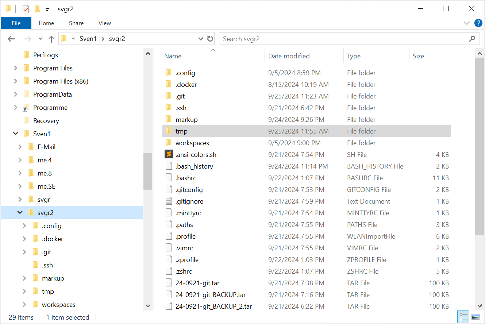

## 2. *Filesystem* and *$HOME* directory

Topics:
- a) [What is a *filesystem*?](#a-what-is-a-filesystem)
- b) [How is a *filesystem* organized (*files, directories, mounts, links*)?](#b-how-is-a-filesystem-organized)
- c) [What is and where is my *$HOME* directory?](#c-what-is-and-where-is-my-home-directory)
- d) [What is in my *$HOME* directory (*dotfiles*)?](#d-what-is-in-my-home-directory)


---
&nbsp;

Built-in computer memory (RAM) does not preserve data over power cycles.
Hence, there is a need to permanently store data on external storage.

External storage traditionally has been magnetic with setting north/south
orientiation of magnetic particles that was preserved in particles.
Magnetic particles were put on movable carriers (tape, drums or disks)
such that a particle could be positioned under a read/write head.


Today, [Solid-State (SSD)](https://en.wikipedia.org/wiki/Solid-state_drive)
technology is used that no longer requires moving parts and uses electric
charges in MOSFET
[Floating Gate Transistor](https://www.embedded.com/flash-101-types-of-nand-flash)
to presever information.

Example of a modern 1TB SSD hard disk:


However, the underlying interfaces (SATA, SAS) assuming a linear *block structure*
remain unchanged although SSD-memory is directly accessible (modern interfaces
take this into account, e.g. *SATA.2, NVMe*).


---
&nbsp;
### a) What is a *filesystem*?

The smallest unit written to external storage is a *block* of 4k, 8K or 16k
bytes. An external medium is seen as a sequence of *blocks*: 1 .. n.

Assuming 8k block size, a 1TB "hard drive" contains 134,217,728 blocks of 8k byte
size. Files smaller than 8k fit in 1 block. Larger files require more blocks.

A [filesystem](https://www.geeksforgeeks.org/file-systems-in-operating-system)
is software (part of the operating system) and data structures that keep track
of the relation between files and blocks of the underlying storage medium.

The data structure describing these relations itself must be persistent and
therefore also be represented on the underlying storage medium. Certain blocks
are therefore occupied by the filesystem itself.

Furthermore, people assume files to be named. Therefore, the filesystem also
manages organizational (directories) and desciptive data (meta-data) for files
that include names (in directories) and times of creation, last modification,
the actual file size, access rights, etc. in the file's meta-data (*i-node*),
which also includes the linkage to blocks or the starting block.

Filesystems differ in how relations between file meta-data and blocks are
organized. For example, Windows *FAT* (File Allocation Table) uses a linked
list of blocks that comprise a file. Most modern filesystems use variations
of tree structures to allow for faster access time.


---
&nbsp;
### b) How is a *filesystem* organized?

Since the amount of files is large, people furthermore an organizational
structure that allows them to group files. For this, hierarchical
*directories* were introduced in most filesystems.

A *directory* (or *folder*) contains a list of names representing files
"that reside in that folder".

Folders may contain other folders creating a hierarchical structure that starts
with a *root directory*: `[ / ]`.


&nbsp;

A *path* describes a path through the hierarchy from one folder to another.

An *absolute path* always starts at the *root directory*: `[ / ]`.

A *relative path* starts at the *current* or *working directory*.
Special names `[ . ]` and `[ .. ]` refer to the *current* or *parent directory*.

While the *root directory*: `[ / ]` is the same for all processes, the
*current* or *working directory* is specific for a process and can be
changed for each process.

For a *shell* process, command `cd` (change directory) is used.

Command `pwd` (*print working directory*) shows the current *working directory*.

```sh
cd /usr/bin         # change the current directory to '/usr/bin' (abs. path)
pwd                 # pwd: print working directory
/usr/bin

cd ..               # cd one level up -> /usr
cd lib              # cd from current directory: /usr one level down into /usr/lib
cd ../../etc        # cd from /usr/lib two levels up (-> '/') and into /etc
cd /etc             # does the same with absolute path: /etc
```

*Links* are names in directories associated with a path pointing to another
file or directory. The path is stored in a file and therefore permanent
(called a *"symbolic link"*).

Links can be created with the `ln` command and removed
with the `rm` command.

```sh
cd                      # change to the HOME directory
ln -s /usr/lib usl      # create symbolic -s link with name 'usl' in current
                        # directory pointing to directory: /usr/lib

ls -la usl              # show new link in current directory
lrwxrwxrwx 1 8 Sep 24 22:53 usl -> /usr/lib/

cd usl                  # cd follows link and changes to /usr/lib
```

*Mounts* allow to connect (*"mount"*) filesystems, e.g. from different external
media. One filesystem's root directory is attached to a directory of another
filesystem. That directory is called *"mount point"*. Content of this directory
is then overlayed with the content of the *root* directory of the mounted
file system.

Mounts are initiatiated with the `mount` command and `umount` to un-mount.
Mounts can be assoiated with permission and access rights. For example, a
filesystem can be mounted *"read-only"* with files underneath the mount point
cannot be altered.

Paths and commands can cross mount points and reach into any directory (assuming
permissions).

```sh
cat /etc/mtab           # show currently mounted filesystems
C:/opt/cygwin64/bin /usr/bin ntfs binary,auto 1 1
C:/opt/cygwin64/lib /usr/lib ntfs binary,auto 1 1
C:/opt/cygwin64 / ntfs binary,auto 1 1
C: /c ntfs binary,noacl,posix=0,user,noumount,auto 1 1
```


---
&nbsp;
### b) What is and where is my *$HOME* directory?

The *$HOME* directory is a directory associated with every user on a system.
It usually has the name of the user, e.g. `meyer` for user Meyer and is located
in the `users` directory.

*HOME* is the name of an environment variable that contains the absolute path
to a user's home directory.

After login or opening a terminal, a *shell* process starts in the
*$HOME* directory.

```sh
cd                  # cd with no argument changes to the $HOME directory
pwd                 # print working directory (which is $HOME after 'cd')
/c/Sven1/svgr2      # output shows the absolute path to the $HOME directory

# print line with value ($) of HOME variable -> $HOME
echo "home directory: $HOME"
home directory: /c/Sven1/svgr2
```

Open a terminal and print the value of the $HOME variable.

Open `explorer` (Windows), `finder` (Mac) or a *file manager* (Linux) and
navigate to your $HOME directory.

The `Explorer`/`Finder` content of the $HOME directory should show the same
content as in the terminal with: `ls -la`

<table>
<td valign="top">

<td valign="top">

</table>

`Windows/cygwin`: after installation, $HOME directories start in the cygwin
installation folder, e.g.: `C:/Program Files/cygwin64/home/svgr2`.
Follow [instructions]() to relocate the $HOME directory.


---
&nbsp;
### c) What is in my *$HOME* directory?

The *$HOME* directory is the place where applications store user-specific
configuration information in files or directories that often start with a
dot `[.]` making then *"hidden"* in the *$HOME* directory.

In order to see them, those *"hidden files"* must be made visible.
Follow instructions to show hidden files
[on Windows](https://www.howtogeek.com/446/show-hidden-files-and-folders-in-windows/) or
[on Mac](https://www.avast.com/c-mac-show-hidden-files).

Dotfiles are regular text files and dot-directories are regular directories.

Show which hidden files already exist in the $HOME directory:

```sh
cd                  # change to $HOME directory
ls -la -d .*        # list dotfiles starting with .*
```

Output shows dotfiles and dot-directories (may vary):

```
   -rw-r--r-- 1 svgr2 Kein  1917 Sep 24 23:14 .bash_history
   -rw-r--r-- 1 svgr2 Kein 10264 Sep 22 13:07 .bashrc
-> drwxr-xr-x 1 svgr2 Kein     0 Sep  5 20:59 .config      <-- .dot directory
-> drwxr-xr-x 1 svgr2 Kein     0 Aug 15 10:19 .docker      <-- .dot directory
-> drwxr-xr-x 1 svgr2 Kein     0 Sep 25 11:23 .git         <-- .dot directory
   -rw-r--r-- 1 svgr2 Kein  1054 Sep 21 19:53 .gitconfig
   -rw-r--r-- 1 svgr2 Kein   174 Sep 21 19:59 .gitignore
   -rw-r--r-- 1 svgr2 Kein   376 Sep 21 19:54 .minttyrc
   -rw-r--r-- 1 svgr2 Kein  5731 Sep 21 19:55 .profile
-> drwxr-xr-x 1 svgr2 Kein     0 Sep 21 18:42 .ssh         <-- .dot directory
   -rw-r--r-- 1 svgr2 Kein  1056 Sep 21 19:55 .vimrc
   -rw-r--r-- 1 svgr2 Kein   360 Sep 22 13:03 .zprofile
   -rw-r--r-- 1 svgr2 Kein  4152 Sep 22 13:07 .zshrc
```

Important dotfiles (dot-directories) are:

- `.profile`: contains *bash* commands that are executed once when a new
    terminal is opened.

- `.bashrc`: contains *bash* commands executed every time a new *bash shell*
    is started.

  - Mac uses *zsh* with `.zprofile` and `.zshrc` dotfiles.

- `.gitconfig`: user-specific *git* configurations that apply to all
    user's git projects.

- `.ssh`: dot-directory that contains public and private key pairs for
    remote authentication (e.g. at *GitHub*, *GitLab* repositories or in
    cloud accounts).

- `vimrc`: user's configuration for the *vim* text editor.

- `.minttyrc`: user's configuration for the *mintty* terminal emulator.

- `.docker`: dot-directory that contains user-specific configuration information
    for *Docker*.

Dotfiles are text files. In order to change them, a decent text editor should be
installed on the laptop such as:

- [sublime](https://www.sublimetext.com) or

- `vim`, [tutorial](https://opensource.com/article/19/3/getting-started-vim).

See [section 4 ](04-dotfiles) for specifically setting up the environment.


&nbsp;
---
### References

- [1] Stanford Seminar: *Computer Systems CS110*,
    [*Lecture 2: Introduction to Filesystems*](https://web.stanford.edu/class/cs110/summer-2021/lecture-notes/lecture-02),
    ([Lecture Notes](https://web.stanford.edu/class/cs110/summer-2021/lecture-notes)), (2021).

- [2] Stanford Seminar: *Computer Systems CS110*,
    [*Lecture 3: Directories and Links*](https://web.stanford.edu/class/cs110/summer-2021/lecture-notes/lecture-03), (2021).

- [3] Dionysia Lemonaki:
    [*What are Dotfiles?*](https://www.freecodecamp.org/news/dotfiles-what-is-a-dot-file-and-how-to-create-it-in-mac-and-linux/),
    (2021).

---
&nbsp;
