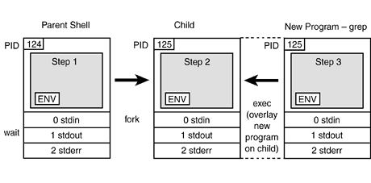
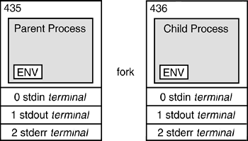

## 3. *Processes* and *Environment Variables*

Topics:
- a) [Process creation and inheritance](#a-process-creation-and-inheritance)
- b) [Global and local *environment variables*](#b-global-and-local-environment-variables)
- c) [Variables: *$HOME*, *$PATH*](#c-variables-home-path)


---
&nbsp;
### a) Process creation and inheritance

In a Unix-type system (and in Windows) all(!) programs are executed as
*processes*.

A *process* is created by the operating system as a unit of execution
comprised of:

- a program (an executable file, e.g. `/usr/bin/bash.exe`),

- process-specific data: *static data, heap data, call stack*,

- an *environment* with environment variables, e.g. `PATH` separated in:

  - *local variables* that are present for the executing process and

  - so-called *global variables* that are present for the executing process and
    that are passed to *child processes*.

- connectors for input and output: `stdin`, `stdout`, `stderr` that can be
    connected

    - to a terminal (keyboard: `stdin`, screen: `stdout`, `stderr`),

    - to files using input- output-redirect ( `>`, `<` ) or can be connected

    - to other processes through *pipes* ( `|` ):

Examples:
```sh
echo "class HelloWorld { }" > HelloWorld.java   # output redirect to file '>'

cat HelloWorld.java | wc                        # connect processes via pipe '|'
```

In the examples, processes executing programs (`echo`, `cat`, `wc`) are
created by the *shell* process receiving commands.

The *shell* process passes its global environment variables on to all
created *child processes* - or: *Child processes* inherit global variables
from their *parent process*.

A new process is created when a (parent-) calls `fork()`, which is system call
that is handled in the operating system kernel.
The operating system creates a new process instance (new `process-ID`) and
duplicates the parent process (code, data, environment variables).

The parent-process then *"executes twice"*. In the "*child*"-part, the program
gets then usually replaced by a new program using the `exec(prog, args)` function:

```c
#include <stdio.h>
#include <sys/wait.h>
#include <unistd.h>

int main(int argc, char **argv) {
    printf("parent: %ld\n", (long) getpid());
    // 
    // fork() duplicates the parent process and returns 0 for parent and
    // the process id (pid) >0 for the new child process
    pid_t p = fork();
    if(p) {
        // parent part: wait for the child to return/exit
        printf("parent: %ld, child: %ld\n", (long) getpid(), (long) p);
        pid_t p2 = wait(&(int) {0});
        printf("parent: p==p2? %d\n", p==p2);
    } else {
        // child part: replace parent program with program to execute:
        // 'grep source .bashrc'
        printf("child: %ld\n", getpid());
        return exec("/usr/bin/grep", "grep", "source", ".bashrc", NULL);
    }
}
```

The figure below shows the steps of creating a child-process:

- step 1: parent process issues `fork()` system call.

- step 2: operating system duplicates parent process. `fork()` returns
    `process-id > 0` to initiating parent process and `process-id==0`
    to new child process.

- step 3: child-process replaces code with the program to actually
    execute using `exec()`.

Other properties of the parent process (e.g. global environment variables)
remain unchanged.




<!-- 

-->


---
&nbsp;
### b) Global and local *environment variables*

Environment variables can be shown and defined by *shell* commands. A dollar
sign (`$`) must be used to refer to the value of the variable:

```sh
echo $NEW_VAR               # show content ('$') of variable NEW_VAR
                            # content is empty (undefined)

NEW_VAR="a new variable"    # define variable NEW_VAR

echo $NEW_VAR               # show content again
a new variable              # now content is present

unset NEW_VAR               # remove variable
echo $NEW_VAR               # show content
                            # content is again empty (undefined)
```

Variable `NEW_VAR` was defined only for the *shell* process that executed
commands.

In order to pass the variable to child processes of *shell*, the variable
must be *"exported"*.

```sh
NEW_VAR="a new variable"    # define variable NEW_VAR
export NEW_VAR              # turn variable in global variable

export NEW_VAR="a new variable"         # combine both
```

When a new terminal is opened from this *shell*, all global variables
are passed on to the new terminal and *shell* processes:

```sh
mintty                      # create new terminal process (opens new terminal)
```

The *shell* process in the new terminal has the variable:

```sh
echo $NEW_VAR
a new variable
```

When a new terminal is opened through an icon or a contect menu
(not through the *shell* above), the variable is not present:

```sh
echo $NEW_VAR               # empty, undefined
```


---
&nbsp;
### c) Variables: *$HOME*, *$PATH*

The `env` or `declare -p` or `compgen -e` (bash) commands lists environment
variables.
<!-- 
show global (exported) variables:
- bash: compgen -e
- zsh: set -o extendedglob; print -roC1 -- ${(k)parameters[(R)^*export*]}
-->

*$HOME* always points to the user's home directory and can be used in commands,
e.g.: `cd $HOME`.

*$PATH* is a global environment variable of a list of directories in which
*shell* searches for executable commands when they are not specified with a path.

For example:

```sh
/usr/bin/grep.exe source .bashrc        # call 'grep' command with full path
```

Calling `grep` without path, requires its path `/usr/bin` to be included in the
*$PATH* variable. *Shell* then searches *$PATH* and executes the first
matching path/command.

If the path for the command was not on *$PATH*, an error: `command not found` is
issued.

```sh
echo $PATH          # show content of PATH variable
.:/usr/local/bin:/usr/bin:/bin:/c/WINDOWS:/c/WINDOWS/system32:/c/WINDOWS/System32/WindowsPowerShell/v1.0:/c/Program Files (x86)/Git/cmd:/c/Users/svgr2/AppData/Local/Programs/Microsoft VS Code/bin:/c/Program Files/Java/jdk-21/bin:/c/opt/maven/bin:/c/Users/svgr2/AppData/Local/Programs/Python/Python312:/c/Users/svgr2/AppData/Local/Programs/Python/Python312/Scripts:/c/Program Files/Docker/Docker/resources/bin
```

Replacing the seperator sign `:` with newline `\n`:

```sh
echo $PATH | tr ':' '\n'
```
exposes the structure of the *$PATH* variable:
```
.                   <-- programs in the current directory (.) are found first
/usr/local/bin
/usr/bin            <-- allows commands like `vi`, `grep` rather than with
/bin                    full path: `/usr/bin/grep`, `/usr/bin/vi`
/c/WINDOWS
/c/WINDOWS/system32
/c/WINDOWS/System32/WindowsPowerShell/v1.0
/c/Program Files (x86)/Git/cmd
/c/Users/svgr2/AppData/Local/Programs/Microsoft VS Code/bin
/c/Program Files/Java/jdk-21/bin        <-- find `java`, `javac`, `jar`, etc.
/c/opt/maven/bin                        <-- find command 'mvn'
/c/Users/svgr2/AppData/Local/Programs/Python/Python312      <-- find `python`
/c/Users/svgr2/AppData/Local/Programs/Python/Python312/Scripts
/c/Program Files/Docker/Docker/resources/bin
```

The *$PATH* variable must be set such that it is inherited to all processes,
typically in *shell* rc-files: `.bashrc` or `.zshrc` (Mac).


&nbsp;
---
### References

- [1] Stanford Seminar: *Computer Systems CS110*,
    [*Lecture 5: Processes*](https://web.stanford.edu/class/cs110/summer-2021/lecture-notes/lecture-05),
    ([Lecture Notes](https://web.stanford.edu/class/cs110/summer-2021/lecture-notes)), (2021).

---
&nbsp;
