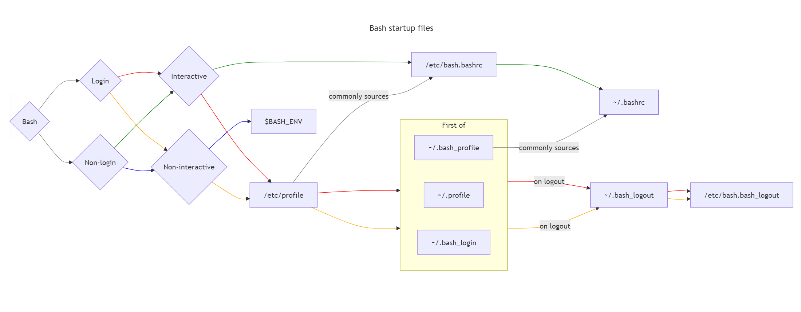
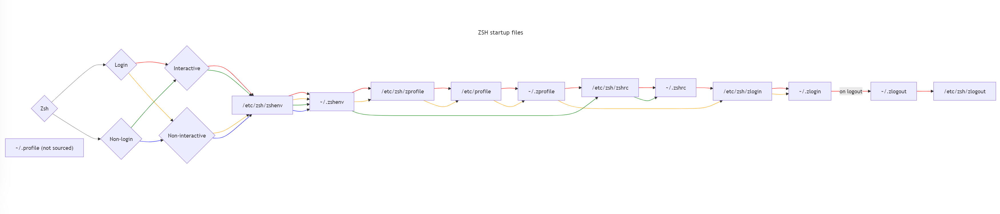

## 4. *Dotfiles*

Topics:
- a) [What are *Dotfiles*?](#a-what-are-dotfiles)
- b) [Role of *profile*, *rc* and *logout* files](#b-role-of-profile-rc-and-logout-files)
- c) [Execution order](#c-execution-order)
- d) [History files](#d-history-files)
- e) [*Sourcing* dotfiles](#e-sourcing-dotfiles)


---
&nbsp;
### a) What are *Dotfiles*?

"Dotfiles" are files (or directories with files) with names that start
with a dot `[.]`. They contain vital setup and configuration information
for the system and for tools. Most dotfiles are stored in the user's
`$HOME` directory.

On most systems, dotfiles are "hidden" (not visible) in the filesystem by default. To show them, follow instructions for Mac or Windows.


---
&nbsp;
### b) Role of *profile*, *rc* and *logout* files

Prominent dotfiles are *.profile*, *.zprofile* (Mac) in a User's `$HOME`
directory that automatically run *on Login* (or a new terminal is opened)
and *.bashrc*, *.zshrc* (Mac) that run when a *new shell process starts*.

*"Profile"* scripts run upon startup, login, when a new terminal is opened
or after login in a remote system (a remote machine or local or remote
virtual machines or containers).

*"Profile"* perform tasks that last for the entire session and can be
inhertited (*"exported"*) to sub-processes (e.g. *shells*).

*"rc-files"* execute evertime a new *shells* starts and their impact
should is valid for the existence of the *shell* process only and
can be exported to sub-processes of the *shell* process.

*"logout"* execute when a session (a terminal) is closed.


---
&nbsp;
### c) Execution order

Before *profile* and *rc-files* from the User's `$HOME` directory, system-wide
files execute that are hosted in the `/etc` (pronounce: *et'see*) directory.

```
/etc/profile
```

Exact execution order of *profile*, *rc-* and *logout-* files varies for *shells*.

The chart shows the full execution path for *bash* (source: [3]):



This chart shows the execution path for *zsh* (Mac) (source: [3]):



More detail can be found in [3].


---
&nbsp;
### d) History files

*History-files*, e.g. `.bash_history` store typed commands as a conseutive list.
They can be recalled by the `history` command to avoid double typing.

*History-files* are also stored in the User's `$HOME` directory. They are
automatically created by *Shells*.

Prompts usually indicate the command number under which a file is stored in the
*history-file*.


---
&nbsp;
### e) *Sourcing* dotfiles

*"Sourcing"* dotfiles (or any script) refers to the *Shell* command:
[*source*](https://linuxcommand.org/lc3_man_pages/sourceh.html).

```sh
$ source ~/.bashrc          # sourcing the .bashrc file executes commands by the
                            # same shell process.
```

Commands from the script are executed *within* the context of the same
*Shell* and are therefore effective for this *Shell* making changes
to environment variables, e.g. `export PATH+=":/bin/java/jdk-21/bin"`
effective for the terminal *Shell*.

In contrast, for *script execution* (without `source`), the terminal *Shell*
will create a sub-process (a *child-Shell* process) execute the script.
Changes to the environment (e.g. to `$PATH`) will be effecitve in the
*child-process* only and *not propagate back* to the parent *Shell* in
the terminal.

```sh
$ cleanup.sh                # commands of the 'cleanup,.sh' script are executed
                            # by a sub-process (child-shell)
```


&nbsp;
---
### References

- [1] Dionysia Lemonaki:
    [*What are Dotfiles?*](https://www.freecodecamp.org/news/dotfiles-what-is-a-dot-file-and-how-to-create-it-in-mac-and-linux/),
    (2021).

- [2] *A Curated List of Awesome Dotfiles*,
    [[*link*]](https://github.com/webpro/awesome-dotfiles).

- [3] Stackoverflow, *Complete overview of Bash and Zsh startup files sourcing order*, 
    [[*link*]](https://superuser.com/questions/1840395/complete-overview-of-bash-and-zsh-startup-files-sourcing-order)

---
&nbsp;
